# Sensor Data Pipeline Framework

A modular, extensible data pipeline for processing time-series sensor data with Prefect 3 orchestration and Docker containerization.

## 🚀 Quick Start

```bash
# Clone and run immediately (Standalone Mode)
git clone <repo>
cd sensor_pipeline
docker compose run --rm --build pipeline data/sensor_data.json out/mesh_summary.json
```

Results appear in `./out/mesh_summary.json` after processing.

> **💡 Tip:** This uses [Standalone Mode](#-standalone-mode-recommended-for-most-users) for simplicity. See [Architecture](#-architecture) for advanced monitoring options.

## 📋 Pipeline Flow

```mermaid
graph TD
    A["Input Data<br/>JSON/JSONL Files"] --> B["Validate Schema<br/>Check required fields & types"]
    B --> C["Convert Timestamp<br/>UTC → Eastern Time"]
    C --> D["Convert Temperature<br/>Celsius → Fahrenheit"]
    D --> E["Detect Anomalies<br/>Temperature, humidity & status alerts"]
    E --> F["Validate Processed Schema<br/>Verify all transformations applied"]
    F --> G["Deduplicate Readings<br/>Remove duplicate sensor readings"]
    G --> H["Aggregate by Mesh<br/>Group & compute counts/averages"]
    H --> I["Validate Output Schema<br/>Final schema check"]
    I --> J["Output Results<br/>JSON mesh summaries"]
    
    style A fill:#e1f5fe
    style J fill:#e8f5e8
```



## 📁 Repository Structure

```
sensor_pipeline/                    # Framework-agnostic core code
├── __init__.py
├── models.py                       # Pandera schemas + Pydantic config models
├── transforms/                     # Transformation modules
│   ├── __init__.py
│   ├── convert_timestamp.py       # UTC → EST conversion
│   ├── convert_temperature.py     # Celsius → Fahrenheit
│   ├── detect_anomalies.py        # Temperature/humidity/status alerts
│   ├── validate_schema.py         # Data validation with Pandera
│   ├── deduplicate_readings.py    # Remove duplicate sensor readings
│   └── aggregate_mesh.py          # Group by mesh_id and aggregate
├── sources/                        # Data source implementations
│   ├── __init__.py
│   ├── source_base.py             # SensorSource ABC
│   └── file_source.py             # JSON/JSONL file loader
├── pipeline.py                    # Generic pipeline composer
└── cli.py                         # Command-line interface

sensor_pipeline_prefect/           # Prefect 3 wrapper
└── flow.py                        # Prefect flow with tasks

data/
└── sensor_data.json               # Demo data (50,000 sensor readings)

tests/                             # Pytest suite
├── __init__.py
├── sensor_pipeline/               # Mirror source structure
│   ├── test_pipeline.py           # Pipeline integration tests
│   ├── sources/
│   │   └── test_file_source.py    # File source tests
│   └── transforms/                # Individual transform tests
│       ├── test_convert_timestamp.py
│       ├── test_convert_temperature.py
│       ├── test_detect_anomalies.py
│       ├── test_validate_schema.py
│       ├── test_deduplicate_readings.py
│       └── test_aggregate_mesh.py
└── sensor_pipeline_prefect/       # Prefect flow tests
    └── test_flow.py

# Docker & Development
Dockerfile                         # Python 3.12-slim
docker-compose.yml                 # Pipeline service + optional UI
.devcontainer/devcontainer.json    # VS Code Dev Container
pyproject.toml                     # Poetry dependencies & config
.pre-commit-config.yaml            # Code quality hooks (ruff, mypy)
```

## 🔧 Architecture

### Deployment Options

The pipeline supports two deployment modes:

#### **🚀 Standalone Mode (Recommended for most users)**
```
┌─────────────────────────────────────────┐
│              pipeline                   │
│                                         │
│  ┌─────────────┐    ┌─────────────────┐ │
│  │    CLI      │───▶│  Core Pipeline  │ │
│  │             │    │                 │ │
│  │ • File I/O  │    │ • Transforms    │ │
│  │ • Args      │    │ • Processing    │ │
│  └─────────────┘    └─────────────────┘ │
└─────────────────────────────────────────┘
                       │
                       ▼
              out/mesh_summary.json
```

**Usage:**
```bash
docker compose run --rm pipeline data/sensor_data.json out/results.json
```

**Benefits:** Simple, fast, direct output, no dependencies

#### **📊 Server Mode (Advanced monitoring)**
```
┌─────────────────┐    HTTP API    ┌─────────────────┐
│ pipeline-server │ ────────────► │ prefect-server  │
│                 │               │                 │
│ • Prefect Flow  │               │ • Web UI        │
│ • Task Engine   │               │ • Database      │
│ • Monitoring    │               │ • API Server    │
└─────────────────┘               └─────────────────┘
        │                                  │
        ▼                                  ▼
out/mesh_summary.json              http://localhost:4200
```

**Usage:**
```bash
docker compose --profile ui up -d              # Start server
docker compose --profile ui run --rm pipeline-server    # Run with monitoring
open http://localhost:4200                     # View dashboard
```

**Benefits:** Web dashboard, run history, scheduling, team collaboration

### Core Pipeline Steps

1. **Validate Input Schema** (`ValidateSchema`)
   - Validates incoming sensor data against Pandera schema
   - Ensures required fields are present with correct types
   - Provides detailed error messages for invalid data

2. **Convert Timestamps** (`ConvertTimestamp`)
   - Converts UTC timestamps to Eastern Time
   - Handles mixed timestamp formats (normal ISO and malformed +00:00Z)
   - Preserves original timestamp for reference

3. **Convert Temperature** (`ConvertTemperature`) 
   - Adds Fahrenheit temperature field
   - Formula: `temp_f = (temp_c * 9/5) + 32`

4. **Detect Anomalies** (`DetectAnomalies`)
   - **Temperature alerts**: < -10°C or > 60°C
   - **Humidity alerts**: < 10% or > 90%
   - **Status alerts**: `status != "ok"`
   - Creates separate alert fields for each anomaly type

5. **Validate Processed Data** (`ValidateSchema`)
   - Validates intermediate processing results
   - Ensures all transformations applied correctly

6. **Deduplicate Readings** (`DeduplicateReadings`)
   - Removes exact duplicate readings based on mesh_id, device_id, and timestamp
   - Keeps first occurrence when duplicates exist
   - Ensures data quality before aggregation

7. **Aggregate by Mesh** (`AggregateMesh`)
   - Groups readings by `mesh_id`
   - Computes temperature/humidity averages for valid readings
   - **Counts anomalies** instead of boolean flags for better insights:
     - `temperature_anomaly_count`: Number of temperature alerts
     - `humidity_anomaly_count`: Number of humidity alerts  
     - `status_anomaly_count`: Number of status alerts
   - Calculates `healthy_reading_percentage`: % of readings with zero alerts

8. **Validate Output Schema** (`ValidateSchema`)
   - Final validation of aggregated mesh summary
   - Ensures output format matches Pandera schema

### Extensible Design

- **Source abstraction**: `SensorSource` ABC with `FileSource` implementation for JSON file sources
- **Transform interface**: All transforms implement `transform(df) -> df`
- **Pipeline composition**: Generic `Pipeline` class chains transforms
- **Configuration**: `PipelineConfig` centralizes thresholds

## 🐳 Docker Usage

### Basic Pipeline Execution
```bash
# Build and run once
docker compose run --rm --build pipeline data/sensor_data.json out/mesh_summary.json

# Run again quickly (no rebuild)  
docker compose run --rm pipeline data/sensor_data.json out/mesh_summary.json

# Custom input/output files
docker compose run --rm pipeline data/my_data.json out/custom_results.json

# For Prefect orchestration (advanced)
docker compose run --rm --entrypoint="" pipeline \
  python -m sensor_pipeline_prefect.flow \
  --param input=file:data/my_data.json \
  --param output_path=out/custom_results.json \
  --param temp_low=-5.0 \
  --param temp_high=50.0
```

### Docker Services Overview

| Service | Purpose | When to Use |
|---------|---------|-------------|
| `pipeline` | Standalone CLI pipeline | Basic usage, development, simple automation |
| `pipeline-server` | Pipeline with Prefect integration | Advanced monitoring, team collaboration |
| `prefect-server` | Prefect web UI and API | When using `pipeline-server` |

### Prefect UI (Optional)
```bash
# Start Prefect server and UI
docker compose --profile ui up -d

# Run pipeline with Prefect server integration
docker compose --profile ui run --rm pipeline-server

# Access UI at http://localhost:4200
open http://localhost:4200

# View pipeline runs and logs in the UI
```

> **⚠️ Important:** Always use `--profile ui` with both `up` and `run` commands to ensure proper network connectivity between services.

### Development Container
```bash
# VS Code: Open folder in Dev Container
# Environment is automatically set up with poetry and dependencies
```

## 📊 Input/Output Format

### Input (JSON)
```json
{
  "mesh_id": "mesh-003",
  "device_id": "device-001", 
  "timestamp": "2025-03-21T21:22:44.052986Z",
  "temperature_c": -13.6,
  "humidity": 43.5,
  "status": "ok"
}
```

### Output (JSON)
```json
[
  {
    "mesh_id": "mesh-001",
    "avg_temperature_c": 30.12,
    "avg_temperature_f": 86.22,
    "avg_humidity": 49.31,
    "total_readings": 10018,
    "temperature_anomaly_count": 3036,
    "humidity_anomaly_count": 1264,
    "status_anomaly_count": 1505,
    "healthy_reading_percentage": 55.0
  }
]
```

**Key Output Fields:**
- **Count-based metrics**: Anomaly counts provide richer insights than boolean flags
- **Healthy reading percentage**: Proportion of readings with zero alerts (0-100%)
- **Averages**: Temperature/humidity averages calculated from all readings
- **Total readings**: Number of readings processed per mesh (after deduplication)

## 🧪 Testing

```bash
# Run all tests
pytest tests

# Run specific test modules
pytest tests/sensor_pipeline/transforms/ -v
pytest tests/sensor_pipeline/test_pipeline.py::TestSensorPipeline -v

# Test coverage
pytest --cov=sensor_pipeline tests/sensor_pipeline/

# Code quality checks
pre-commit run --all-files       # All quality checks
```

## ⚡ Prefect Integration

The pipeline uses **Prefect 3** for orchestration with:

- **Caching**: `load_to_df` task cached for 1 hour
- **Retries**: Data loading retries 3x with 10s delay
- **Logging**: All task outputs logged via `log_prints=True`
- **Parameters**: Runtime configuration via flow parameters

### Flow Structure
```python
@flow(name="Sensor-Mesh-Summary", log_prints=True)
def sensor_mesh_summary(input, output_path, temp_low, temp_high, hum_low, hum_high):
    df = load_to_df(input)                    # Cached, retried
    summary = run_core_pipeline(df, config)   # Core processing
    persist(summary, output_path)             # Save results
```

## 🔌 Extensibility Examples

### Adding New Transform
```python
# sensor_pipeline/transforms/my_transform.py
class MyTransform:
    def transform(self, df: pd.DataFrame) -> pd.DataFrame:
        # Your logic here
        return df

# Add to pipeline in sensor_pipeline/pipeline.py
steps = [
    ConvertTimestamp(),
    ConvertTemperature(), 
    MyTransform(),        # <-- Insert anywhere
    DetectAnomalies(config),
    AggregateMesh(),
]
```

### Adding New Data Source
```python
# sensor_pipeline/sources/database_source.py
class DatabaseSource(SensorSource):
    def __init__(self, connection_string: str):
        self.conn = connection_string
    
    def load(self) -> pd.DataFrame:
        # Load from database
        return df

# Use in Prefect flow
@task
def load_to_df(source_url: str) -> pd.DataFrame:
    if source_url.startswith('db:'):
        source = DatabaseSource(source_url[3:])
    elif source_url.startswith('file:'):
        source = FileSource(source_url[5:])
    else:
        raise ValueError(f"Unsupported source URL: {source_url}")
    return source.load()
```

## 🛠️ Development

### Setup (Dev Container)
1. Open in VS Code
2. Command Palette → "Reopen in Container"
3. Automatic setup with Python extensions and poetry environment

### Development Commands
All commands assume you're in the dev container or poetry environment:

```bash
# Run CLI directly
python -m sensor_pipeline.cli data/sensor_data.json out/results.json
# Or use the script
sensor-pipeline data/sensor_data.json out/results.json

# Run Prefect flow
python -m sensor_pipeline_prefect.flow

# Run tests
pytest tests

# Code quality checks (in dev container or with poetry)
pre-commit run --all-files       # All hooks

# Add new dependencies
poetry add package-name

# Update dependencies
poetry update
```

## 📈 Performance Notes

- **Memory efficient**: Processes data in pandas DataFrames
- **Streaming ready**: Transform interface supports chunked processing
- **Caching**: Prefect caches expensive data loading operations
- **Scalable**: Stateless transforms can be parallelized

## 🎯 Design Decisions

1. **Separation of Concerns**: Core pipeline has no Prefect dependencies
2. **Modern Python**: Uses Python 3.12+ type hints (`list[str]`, `str | None`)
3. **Poetry Management**: Dependency management with Poetry and pyproject.toml
4. **Minimal Dependencies**: Only essential packages (pandas, pandera, pydantic, prefect, pytest, pendulum)
5. **Container-First**: Designed for Docker deployment from the start
6. **Test Coverage**: Unit tests for each transform + integration tests
7. **Code Quality**: Enforced via ruff (linting/formatting) and mypy (type checking)